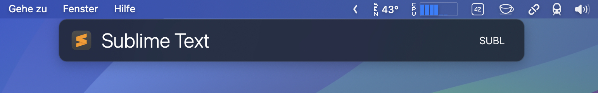

# Get Recently Opened Files with Sublime Text for LaunchBar

This repository provides an action for [LaunchBar](https://www.obdev.at/products/launchbar/actions.html) for accessing recent documents opened with [Sublime Text](https://www.sublimetext.com/). The actions are designed to streamline access to recent files for users of Sublime Text who also happen to use LaunchBar.

:information_source: The LaunchBar action is designed to work together with the companion plugin [`Recent Files Tracker`](https://github.com/alberti42/sublime-recent-files-tracker) for Sublime Text editor.



## Contents

This repository includes the following components:

- **'Recent Sublime Opened Files.lbaction**: LaunchBar action to enable direct access to recent documents.
- **Action.zip**: Pre-packaged LaunchBar action for easy download.
  
## Installation

### Option 1: Manual Installation

1. **Download** the actions from the [Action.zip](https://github.com/alberti42/Get-Recent-ST-Files-For-LaunchBar/raw/refs/heads/main/Action.zip).
2. **Extract** the contents, which include:
   - `Recent Sublime Opened Files.lbaction`
3. Place these `.lbaction` files into your LaunchBar Actions folder:
   ```
   ~/Library/Application Support/LaunchBar/Actions
   ```

4. **Restart LaunchBar** to load the new actions.

### Option 2: Automatic Installation

Alternatively, you can simply double-click each `.lbaction` file. This will automatically install the action in LaunchBar.

## Usage

- Activate LaunchBar and type the name of Sublime Text.
- Press space to display the recent documents directly from LaunchBar.

## Donations

If you find this plugin helpful, consider supporting its development with a donation.

[](https://buymeacoffee.com/alberti)

## Author

- **Author:** Andrea Alberti
- **GitHub Profile:** [alberti42](https://github.com/alberti42)
- **Donations:** [](https://buymeacoffee.com/alberti)

Feel free to contribute to the development of this plugin or report any issues in the [GitHub repository](https://github.com/alberti42/obsidian-plugins-annotations/issues).
